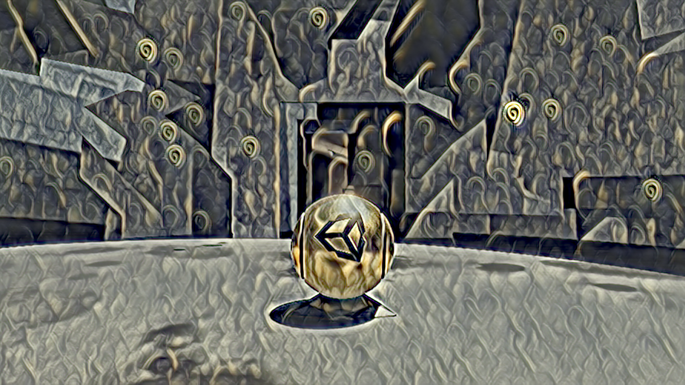

# Barracuda-Style-Transfer-HDRP

This tutorial covers how to perform in-game style transfer in an HDRP project using the Barracuda infefence library.

### TODO:

- Fix preprocessing steps: The final colors are a bit off ([what it's supposed to look like](https://github.com/cj-mills/Barracuda-Style-Transfer-HDRP/blob/main/images/target-result.png)). Probably due to the default texture format used in HDRP.
