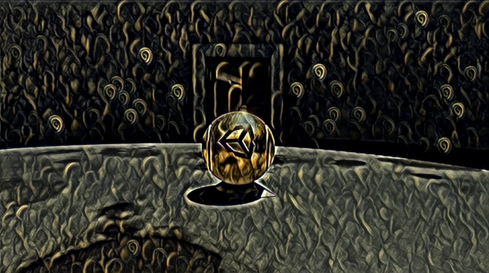

# Barracuda Style Transfer HDRP

This tutorial covers how to perform in-game style transfer in an HDRP project using the Barracuda infefence library.

### TODO:

- ~~Fix preprocessing steps: The final colors are a bit off ([what it's supposed to look like](./images/target-result.png)). Probably due to the default texture format used in HDRP.~~
  - Update: I was wrong, the discrepancy was due to HDRP using linear color space instead of gamma. Issue was resolved by updating the post-processing function.
